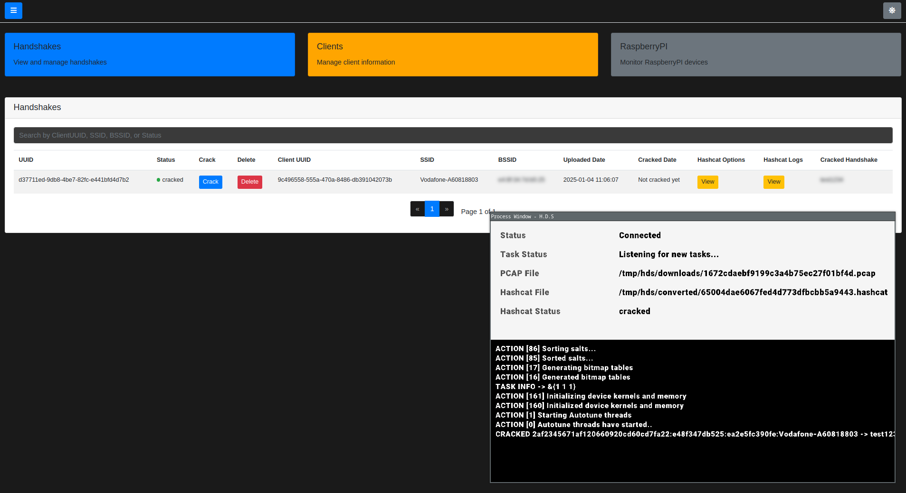

# Distributed Programming University Project

<h2 align="center">
  <br>
  <a href="#"></a>
  <br>
  <b>H.D.S</b>
  <font size='10'><strong></strong></font><br>
  1<sup>st</sup> January 2025
  
Student: <font color='orange'>Angelo Rosa</font>
</h2>

<h1 align="center">
 <a href="https://github.com/Virgula0/H.D.S/stargazers">
        </a>
</h1>

# Screenshots

<p align="center">
  
  
  
  

</p>

## Brief

> **H.D.S (Hashcat-Distributed-Service)** is a university project written entirely in **Go**, designed to distribute WPA handshake cracking tasks across multiple **Hashcat** clients. It serves as a practical proof of concept for distributed password-cracking workloads.

---

## Run the Application (in Test Mode) with Docker

Since `client` within docker runs a GUI application using **Raylib**, it requires access to the host's desktop environment. A utility called `xhost` is needed (`xorg-xhost` on Arch Linux).

Run the following commands:

```
export DISPLAY=:0.0 && \
xhost +local:docker && \
docker compose up --build
```

Access the **Frontend (FE)** by visiting:  
➡️ `http://localhost:4748`

### Docker Containers
The setup will spawn four containers:
- **dp-database**
- **dp-server**
- **emulate-raspberrypi**
- **dp-client**

The provided `docker-compose.yml` file already includes all necessary environment variables for a functional **test environment**. No changes are required to run the project for demonstration purposes.

**Default credentials:** `admin:test1234`  
This account can be used on the frontend to upload and submit WPA handshakes for cracking.

> While the software is primarily designed for **Linux**, GPU capabilities can potentially be shared with a containerized `client` via **WSL** on Windows. Future improvements may include native support for additional operating systems.

---

## Project Features

1. **Handshake Capturing and Uploading:**  
   Users can capture WPA handshakes using tools like **bettercap** (or similar) and use a **daemon** to upload them to the server. Although referred to as `RaspberryPI` in the project, the daemon can run on any platform supporting **Golang**.

2. **Frontend Management:**  
   Users can access the **Frontend (FE)** to:
    - View captured handshakes.
    - Submit them to clients for cracking.
    - Manage connected clients and daemon devices.
    - Remove unnecessary handshakes.

3. **Independent Clients:**  
   Each **client** operates independently and communicates directly with the server. Users can select which client will handle specific cracking tasks.

4. **Modularity:**  
   The software is designed with modularity in mind to simplify future changes and improvements.

---

## Architectural Notes

- While a fully **Clean Architecture** approach wasn't strictly followed, both the **Frontend (FE)** and **Backend (BE)** adopt a similar structure.
- **Entities (database models)** reside in the `server` folder and are shared between **FE** and **BE**.
    - If FE and BE are deployed on separate servers, the `entities` directory must be moved into each respective folder. Minor refactoring will be required.
- **gRPC Communication:**  
  Clients and the backend use **gRPC** for communication. Both must include compiled **protobuf** files:

```
  cd client && make proto
  cd server && make proto
```

---

## Project Scheme


As shown in the diagram, the **Backend (BE)** is isolated and can only be accessed through the **Frontend (FE)**.

### Communication Flow:
- **FE ↔ BE (HTTP/REST API):**
    - **FE:** Sends HTTP requests to BE.
    - **BE:** Handles database interactions and returns data.

- **Daemon ↔ BE (TCP):**
    - After authenticating via **REST API**, the daemon communicates with BE via raw **TCP**.

- **Client ↔ BE (gRPC):**
    - A **bidirectional gRPC stream** allows clients to dynamically send logs and receive updates during **Hashcat** operations.

### Directory Mapping:
- **Client:** -> `/client`
- **Daemon:** -> `/raspberry-pi`
- **Server:** -> `/server`
    - **Backend:** -> `/server/backend`
    - **Frontend:** -> `/server/frontend`

---

## Test scheme

The tests have been implemented in the backend, emulating `gRPC` and `daemon` clients to test out the methods of these 2 protocols.

When running a test, a `gRPC` server or `tcp` server, along with the rest API, is initialized.
It depends on what tests you're running.

It was not that easy to achieve a good solid test scheme, but in the end, it should look something like this.


- `setup_grpc.go` -> set up a grpc mock server to communicate with. It is initialized during `SetupSuite`. The server is killed on `TeardownSuite`. A rest API server is initialized too.
- `tcp_ip.go` -> Set up a tcp mock server to communicate with. It is initialized during `SetupSuite`. The server is killed on `TeardownSuite`.  A rest API server is initialized too.
- `common_grpc.go` -> calls `SetupSuite` and `TeardownSuite`, define a structure with mock data useful in tests
- `common_raspberrypi_test.go` -> calls `SetupSuite` and `TeardownSuite`, define a structure with mock data useful in tests
- `grpc_test.go` -> contains tests for grpc infrastructure
- `raspberrypi_test.go` -> contains tests for raspberrypi infrastructure

> [!IMPORTANT]  
> A database container must be up and running on port 3306 to run tests.

> [!WARNING]  
> You can run tests using `cd server && make test` but env variables must be set before proceeding

```bash
export BACKEND_HOST="0.0.0.0"
export BACKEND_PORT="4747"
export FRONTEND_HOST="0.0.0.0"
export FRONTEND_PORT="4748"
export DB_USER="agent"
export DB_PASSWORD="SUPERSECUREUNCRACKABLEPASSWORD" # This should be changed (remember to change it in database/initialize.sql too)
export DB_HOST="localhost"
export DB_PORT="3306"
export DB_NAME="dp_hashcat"
export ALLOW_REGISTRATIONS="True" # Disable if needed
export DEBUG="True"  # This will enable seeds for having some accounts for testing purposes. admin:test1234 will be created
export RESET="True"
export GRPC_URL="0.0.0.0:7777"
export GRPC_TIMEOUT="10s"
export TCP_ADDRESS="0.0.0.0"
export TCP_PORT="4749"
```

---

## Security and Future Improvements

While security auditing and privacy were not primary objectives for this project, some measures and considerations have been noted:

1. **Encryption:**
    - Currently, **pcap files** sent by the daemon are **not encrypted**.
    - A symmetric encryption key has been generated, but encryption is yet to be implemented.

2. **Daemon Authentication:**
    - Daemon authenticates via **REST API** before establishing a **TCP** connection.
    - Credentials are sent via command-line arguments, which could be stolen easily if a malicious actor have access remotely to the machine.

3. **gRPC Security:**
    - gRPC communication currently lacks **SSL/TLS certificates** for encryption.

### Security Measures Implemented:
- Basic protection against vulnerabilities like **SQL Injection** and **IDORs** has been considered.

> If you have suggestions or improvements, feel free to **open a pull request**.

---

## Project files

<details>
  <summary>List of files</summary>

```
├── client
│   ├── Dockerfile
│   ├── go.mod
│   ├── go.sum
│   ├── internal
│   │   ├── constants
│   │   │   └── constants.go
│   │   ├── entities
│   │   │   ├── auth_request.go
│   │   │   └── handshake.go
│   │   ├── environment
│   │   │   └── init.go
│   │   ├── grpcclient
│   │   │   ├── communication.go
│   │   │   └── init.go
│   │   ├── gui
│   │   │   ├── login_window.go
│   │   │   └── process_window.go
│   │   ├── hcxtools
│   │   │   └── hcxpcapngtool.go
│   │   ├── mygocat
│   │   │   ├── gocat.go
│   │   │   └── task_handler.go
│   │   ├── resources
│   │   │   └── fonts
│   │   │       ├── Roboto-BlackItalic.ttf
│   │   │       ├── Roboto-Black.ttf
│   │   │       ├── Roboto-BoldItalic.ttf
│   │   │       ├── Roboto-Bold.ttf
│   │   │       ├── Roboto-Italic.ttf
│   │   │       ├── Roboto-LightItalic.ttf
│   │   │       ├── Roboto-Light.ttf
│   │   │       ├── Roboto-MediumItalic.ttf
│   │   │       ├── Roboto-Medium.ttf
│   │   │       ├── Roboto-Regular.ttf
│   │   │       ├── Roboto-ThinItalic.ttf
│   │   │       └── Roboto-Thin.ttf
│   │   └── utils
│   │       └── utils.go
│   ├── main.go
│   ├── Makefile
│   └── wordlists
├── database
│   ├── Dockerfile
│   ├── initialize.sql
│   └── my.cnf
├── docker-compose.yaml
├── externals
│   ├── gocat
│   ├── hashcat
│   └── hcxtools
├── LICENSE
├── proto-definitions
│   └── hds
│       ├── hds.proto
│       ├── hds_request.proto
│       └── hds_response.proto
├── proto.sh
├── raspberry-pi
│   ├── Dockerfile
│   ├── go.mod
│   ├── go.sum
│   ├── handshakes
│   │   └── test.pcap
│   ├── internal
│   │   ├── authapi
│   │   │   └── authenticate.go
│   │   ├── cmd
│   │   │   └── command_parser.go
│   │   ├── constants
│   │   │   └── constants.go
│   │   ├── daemon
│   │   │   ├── communication.go
│   │   │   ├── environment.go
│   │   │   └── init.go
│   │   ├── entities
│   │   │   ├── api_entities.go
│   │   │   └── handshake.go
│   │   ├── utils
│   │   │   └── utils.go
│   │   ├── wifi
│   │   │   └── wifi.go
│   │   └── wpaparser
│   │       ├── getwpa.go
│   │       └── parser.go
│   ├── main.go
│   └── Makefile
├── README.md
└── server
    ├── backend
    │   ├── cmd
    │   │   └── main.go
    │   └── internal
    │       ├── constants
    │       │   └── constants.go
    │       ├── errors
    │       │   └── errors.go
    │       ├── grpcserver
    │       │   ├── commands.go
    │       │   ├── common_grpc_test.go
    │       │   ├── controllers.go
    │       │   ├── grpc_test.go
    │       │   ├── init.go
    │       │   └── options.go
    │       ├── infrastructure
    │       │   └── database.go
    │       ├── raspberrypi
    │       │   ├── common_raspberrypi_test.go
    │       │   ├── components.go
    │       │   ├── init.go
    │       │   ├── raspberrypi_test.go
    │       │   └── tcp_server.go
    │       ├── repository
    │       │   └── repository.go
    │       ├── response
    │       │   └── response.go
    │       ├── restapi
    │       │   ├── authenticate
    │       │   │   ├── handler_anonymous.go
    │       │   │   └── handler_user.go
    │       │   ├── client
    │       │   │   └── handler_user.go
    │       │   ├── handlers.go
    │       │   ├── handshake
    │       │   │   └── handler_user.go
    │       │   ├── logout
    │       │   │   └── handler_user.go
    │       │   ├── middlewares
    │       │   │   ├── auth_middlware.go
    │       │   │   ├── common_middleware.go
    │       │   │   └── log_requests.go
    │       │   ├── raspberrypi
    │       │   │   └── handler_user.go
    │       │   ├── register
    │       │   │   └── anonymous_handler.go
    │       │   └── routes.go
    │       ├── seed
    │       │   └── seed_api.go
    │       ├── testsuite
    │       │   ├── auth_api.go
    │       │   ├── setup_grpc.go
    │       │   └── tcp_ip.go
    │       ├── usecase
    │       │   └── usecase.go
    │       └── utils
    │           ├── utils.go
    │           └── validator.go
    ├── Dockerfile
    ├── entities
    │   ├── client.go
    │   ├── handshake.go
    │   ├── raspberry_pi.go
    │   ├── role.go
    │   ├── uniform_response.go
    │   └── user.go
    ├── frontend
    │   ├── cmd
    │   │   ├── custom.go
    │   │   └── main.go
    │   ├── internal
    │   │   ├── constants
    │   │   │   └── constants.go
    │   │   ├── errors
    │   │   │   └── errors.go
    │   │   ├── middlewares
    │   │   │   ├── auth_middleware.go
    │   │   │   ├── cookie_middleware.go
    │   │   │   └── log_requests.go
    │   │   ├── pages
    │   │   │   ├── clients
    │   │   │   │   └── clients.go
    │   │   │   ├── handshakes
    │   │   │   │   └── handshake.go
    │   │   │   ├── login
    │   │   │   │   └── login.go
    │   │   │   ├── logout
    │   │   │   │   └── logout.go
    │   │   │   ├── pages.go
    │   │   │   ├── raspberrypi
    │   │   │   │   └── raspberrypi.go
    │   │   │   ├── register
    │   │   │   │   └── register.go
    │   │   │   ├── routes.go
    │   │   │   └── welcome
    │   │   │       └── welcome.go
    │   │   ├── repository
    │   │   │   └── repository.go
    │   │   ├── response
    │   │   │   └── response.go
    │   │   ├── usecase
    │   │   │   └── usecase.go
    │   │   └── utils
    │   │       ├── utils.go
    │   │       └── validator.go
    │   ├── static
    │   │   ├── images
    │   │   │   └── logo.png
    │   │   ├── scripts
    │   │   │   ├── bootstrap.min.js
    │   │   │   ├── dashboard.js
    │   │   │   ├── github-stats.js
    │   │   │   ├── jquery-3.3.1.min.js
    │   │   │   ├── popper.min.js
    │   │   │   └── theme-toggle.js
    │   │   ├── static.go
    │   │   └── styles
    │   │       ├── bootstrap-4.3.1.min.css
    │   │       ├── custom.css
    │   │       └── main.css
    │   └── views
    │       ├── clients.html
    │       ├── handshake.html
    │       ├── login.html
    │       ├── raspberrypi.html
    │       ├── register.html
    │       ├── views.go
    │       └── welcome.html
    ├── go.mod
    ├── go.sum
    ├── main.go
    └── Makefile

79 directories, 143 files
```


</details>

# Daemon

[Setup](raspberry-pi/README.md)

# Client

[Setup](client/README.md)

# Server

[Setup](server/README.md)

# External Dependencies

Ignoring gRPC and other basic deps

- **RayLib** `github.com/gen2brain/raylib-go/raylib` A basic graphic library
- **Gocat** `github.com/mandiant/gocat/v6` Used for running hashcat in go via `hashcatlib` 
- **Validator** `github.com/go-playground/validator/v10` Validator for go structures
- **Mux** `github.com/gorilla/mux` HTTP router
- **Testify** `github.com/stretchr/testify` A test library for simplifying test syntax
- **Gopacket** `github.com/google/gopacket` Parse `.PCAP` files as layers
- **Wifi** `github.com/mdlayher/wifi` used by daemon for understanding if we're connected to our local network
- **Cobra** `github.com/spf13/cobra` used for parsing command line arguments easily in daemon
